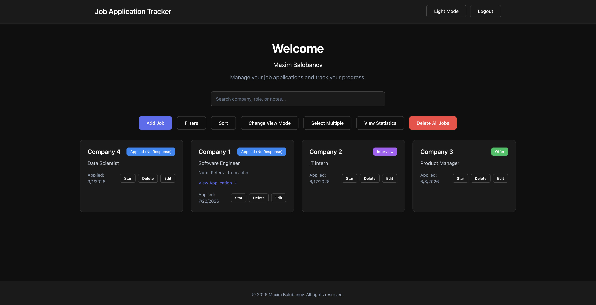
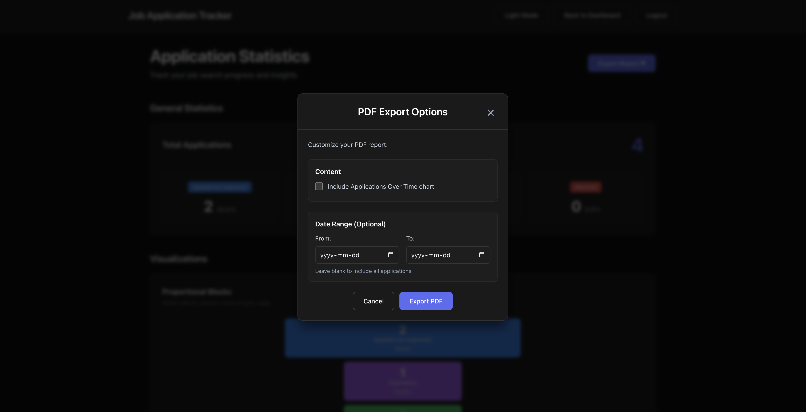

# Job Application Tracker

A full-stack application for organizing job searches through tile, list, and Kanban views, with secure Auth0 authentication, application analytics, status histories, and CSV/PDF export.

**[Live Demo](https://job-application-tracker-nine-gold.vercel.app)**

### Dashboard

### Statistics

---

## What it does

Track applications by company, role, and status. Filter, sort, and search your pipeline, switch between tile, list, and kanban views, and review status history on each job. The statistics page breaks down your search with charts and supports CSV/PDF export. Sign in with email/password or Google.

---

## Tech Stack

**Languages**
- HTML
- CSS
- JavaScript (ES6+)

**Frontend**
- React
- React DOM
- React Router
- Vite
- CSS Modules
- Auth0 (`@auth0/auth0-react`)
- `@dnd-kit/core` & `@dnd-kit/utilities` (kanban drag-and-drop)
- `@react-pdf/renderer` (PDF export)

**Backend**
- Node.js
- Express
- REST API
- JWT authentication (`express-oauth2-jwt-bearer`)
- CORS
- dotenv

**Database**
- PostgreSQL
- `pg` (node-postgres driver)

**Auth**
- Auth0
- OAuth 2.0
- OpenID Connect (OIDC)

**Deployment & Infrastructure**
- Vercel (frontend hosting)
- Render (backend hosting)
- Supabase (managed PostgreSQL)
- Git / GitHub

**Tools**
- npm
- ESLint

---

## Local Setup

Requires Node.js, PostgreSQL, and Auth0 credentials.

1. Clone the repo
2. Create a PostgreSQL database, then open `server/src/db/schema.sql`, copy its contents, and run them in your database tool (e.g. Supabase SQL Editor) to create the tables
3. Install and run the backend: `cd server && npm install && npm run dev`
4. Install and run the frontend: `cd client && npm install && npm run dev`

Frontend runs on `http://localhost:5173`, API on `http://localhost:3001`.

---

## Author

Maxim Balobanov
